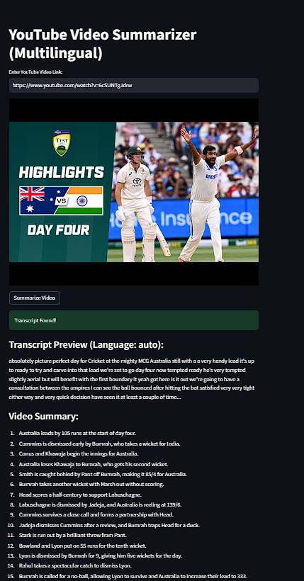
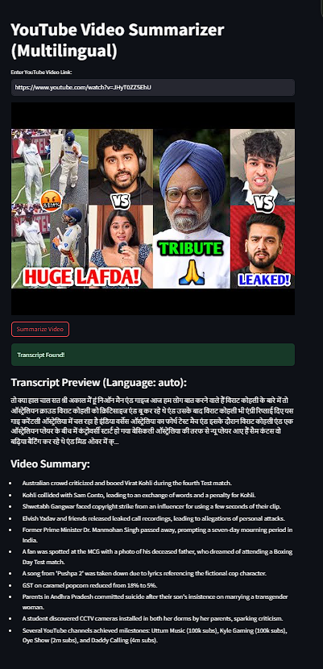

# YouTubeSummarizerAI

An AI-powered multilingual YouTube video summarization tool that extracts, translates, and summarizes video transcripts with precision and ease. Built with Streamlit, Google Generative AI, and YouTube Transcript API for smart, concise content insights.

## Run
streamlit run app.py

## Screenshots

    
    

